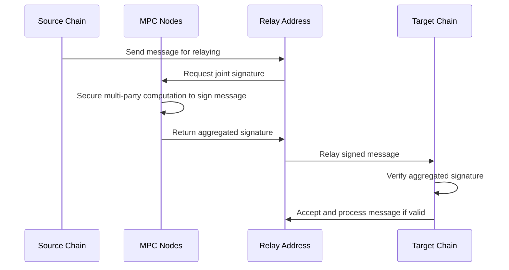

**MPC (Multi-Party Computing) Relay:**
MPC, or Multi-Party Computing, is a cryptographic technique where a computation is securely distributed across multiple nodes, ensuring that no single node has access to the complete data or secret. The MPC relay leverages this concept to securely relay messages across blockchain networks using a single relay address.

**Step 1: Segmenting the Private Key**
In this approach, the private key associated with the relay address is divided into multiple segments, each securely distributed among a set of MPC nodes.

**Step 2: Secure Computation**
These MPC nodes participate in secure multi-party computation protocols to collaboratively sign messages without revealing their private key segments. This ensures that no single node can compromise the security of the entire system.

**Step 3: Relaying the Message**
Once a threshold number of MPC nodes agree to sign, the relay address on the source chain sends the signed message to the target chain. The target chain recognizes the relay address and processes the message, trusting that it has been authenticated via the MPC process.

**Comparison to Multisig**
Unlike the multisig approach, which relies on multiple relay nodes and a whitelist of trusted relayers on the target chain, the MPC relay abstracts this complexity behind a single relay address. The target chain does not need to maintain a whitelist, making the process more efficient while retaining high security.

**Security and Efficiency**
This approach eliminates single points of failure and balances security with operational efficiency, making it ideal for scalable crosschain messaging.

**Analogy**
Imagine a secret that can only be revealed when a group of trusted individuals each contribute a part of the puzzle. No single person holds the entire secret, but together, they can securely unlock it. This is the essence of how MPC relays function.

By adopting MPC relays, crosschain communication becomes not only more secure but also more streamlined, opening new possibilities for decentralized applications that need to operate across multiple blockchain networks.

---

**`Here below is the content as is from the spec just added sections for better readability`**

---

### **MPC (Multi-Party Computing) Relay**

**Overview**  
The MPC relay differs from multisig in that it involves only a single relay address affiliated with the relaying activity between networks. This relay address does not have access to the full private key; instead, the private key is shared into segments and distributed in a cryptographically secure manner among a set of MPC nodes.

**Mechanism**  
These MPC nodes engage in secure multi-party computation protocols to jointly sign messages sent from the relay address without any node revealing its share of the private key.

**Message Signing**  
By having at least a threshold of MPC nodes participate in approving the transmission of crosschain messages, the system can replicate the authentication assurances of a valid digital signature without a single privileged entity.

**Signature Aggregation**  
The relay address is configured on the target chain and trusted to send messages from the source system. The target chain smart contract does not need to hold a whitelist of trusted relayers as in multisig – rather, the relaying participants and business logic are abstracted behind the single relay address governed by decentralized MPC protocols.

**Verification**  
The target chain verifies the authenticity of the message based on the aggregated signature produced by the MPC nodes, ensuring that the message is securely relayed without compromising the private key.

**Security Features**  
This approach balances both security and efficiency goals for crosschain messaging by eliminating the need for multiple relay addresses and a whitelist of trusted relayers. The decentralized nature of MPC ensures that no single entity controls the relay process.

**Example**  
Imagine a scenario where a blockchain network needs to relay a message to another network securely. Instead of relying on multiple nodes each holding a full private key (as in multisig), the MPC relay divides the key into parts and distributes them among several nodes. These nodes work together to sign the message, ensuring it remains secure and trusted without any single node having full control.

---

### **Sequence/Flow Diagram**

---

This labeled explanation and sequence diagram should make it easier for readers to understand the MPC relay process, as well as how it differs from the multisig relay.
