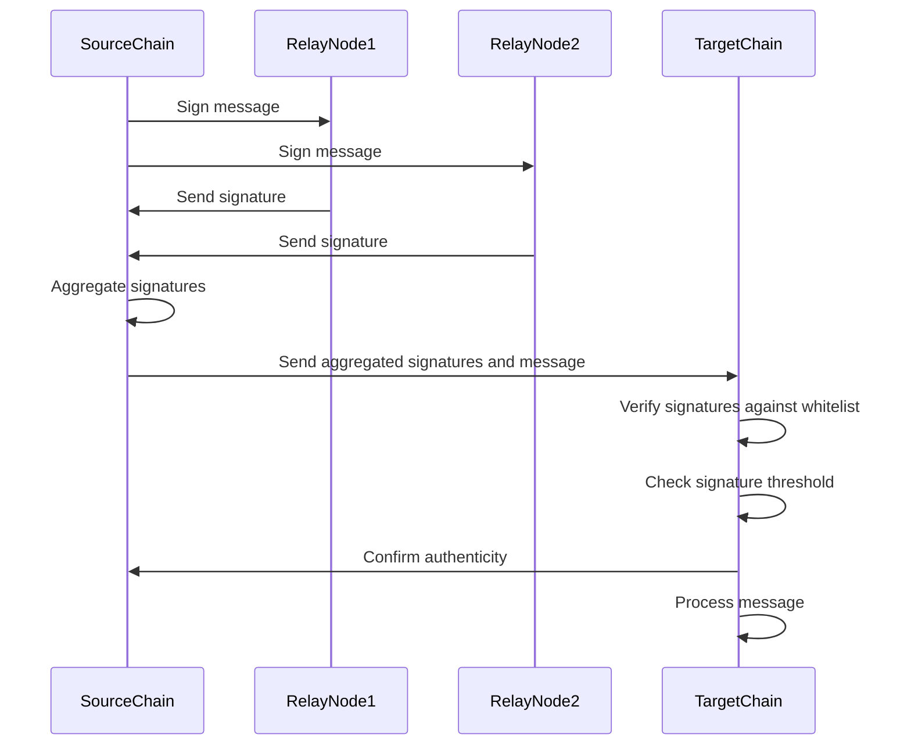

**3.1 Multisig Relay**

* Overview Mechanism*

This approach uses multiple signatures to verify and authenticate messages. Here’s how it works:

1. **Message Signing:**
   - A message is created on the source chain and signed by several independent relay nodes, each with a unique public key. These relay nodes are part of a whitelist maintained by the target chain's smart contract.

2. **Signature Aggregation:**
   - The signatures from these nodes are aggregated into a single signature payload. This payload, along with the original message, is sent from the source chain to the target chain.

3. **Verification:**
   - On the target chain, the smart contract checks the aggregated signature against the whitelist to ensure it includes valid signatures from the required number of trusted relayers. If the verification is successful, the message is deemed authentic and processed.

*Security Features*

- **Decentralization:** Multiple validators are involved in signing the message, reducing the risk of a single point of failure.
- **Integrity Assurance:** By requiring a threshold number of signatures, multisig relay ensures that only messages with broad consensus are trusted.
- **Availability:** The approach provides higher availability and robustness against attacks, as it relies on multiple independent nodes.

*Example*

Think of it like a secure bank transaction that requires approval from multiple managers before it can be processed. Each manager signs off on the transaction, and only if all signatures are valid does the transaction go through.

---

**`Here below is the content as is from the spec just added sections for better readability`**

---

**Multisig Relay**

*Overview*

Multisig relay is a mechanism that leverages multi-signature consensus for relaying messages across blockchains. In this approach, the message originating from a source chain is cryptographically signed by multiple independent relay nodes.

*Mechanism*

**Message Signing:** These relay nodes or validators have public key signatures that are registered and verified against a whitelist of trusted nodes maintained on the target chain's smart contract.

**Signature Aggregation:** The relay nodes' signatures on the message are aggregated and attached to the communication payload sent from the source chain to the smart contract on the target chain.

**Verification:** The target chain's smart contract first verifies that the aggregate signature comprises valid signatures from a threshold number of trusted relayers according to the whitelist. This blockchain-based consensus check establishes multiple attestations of the message's authenticity and integrity. If the multi-signature passes the policy set on the target chain, the message is deemed to have originated genuinely from the source system and can be processed and trusted accordingly by the target chain.

*Security Features*

By decentralizing the act of relaying through multiple participating validators and embedding multi-signature thresholds on target chains, multisig message relay aims to provide stronger security, availability, and integrity assurances for crosschain messaging.

*Example*

Think of it like a secure bank transaction that requires approval from multiple managers before it can be processed. Each manager signs off on the transaction, and only if all signatures are valid does the transaction go through.

---

### Explanation:

- **SourceChain**: Represents the blockchain where the message originates.
- **RelayNode1** and **RelayNode2**: Independent relay nodes that sign the message.
- **TargetChain**: Represents the blockchain where the message is received and verified.

**Flow:**

1. The **SourceChain** sends the message to **RelayNode1** and **RelayNode2** for signing.
2. Each relay node signs the message and sends its signature back to the **SourceChain**.
3. The **SourceChain** aggregates the signatures from the relay nodes.
4. The aggregated message and signatures are sent from the **SourceChain** to the **TargetChain**.
5. The **TargetChain** verifies the aggregated signatures against a whitelist and checks if the threshold is met.
6. If verification is successful, the **TargetChain** processes the message and confirms its authenticity.
