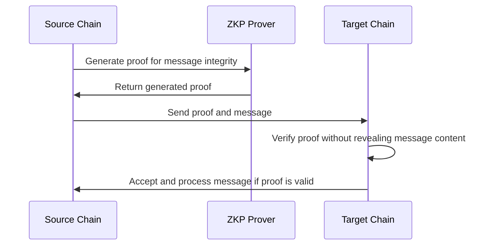

# **ZKP (Zero Knowledge Proof) Relay**

**1. Overview**  
The ZKP relay is a mechanism that leverages advanced cryptographic proof constructions to validate the integrity of crosschain messages without disclosing the actual content of the message. This approach emphasizes both privacy and security in crosschain communication.

**2. Mechanism**  
Two main approaches are employed in ZKP relays: SNARKs (Succinct Non-Interactive Arguments of Knowledge) and STARKs (Scalable Transparent Arguments of Knowledge).

- **SNARK-based Relay:** In a SNARK-based relay, parameters are precomputed among the ZKP system partners to optimize proof generation efficiency. However, this approach requires a trusted setup ceremony, where certain initial parameters are securely generated and shared.
  
- **STARK-based Relay:** In contrast, a STARK-based relay does not rely on any fixed reference string or precomputed parameters, thereby eliminating the need for a trusted setup. STARKs provide transparency and scalability, though they currently come with higher computation overhead.

**3. Proof Generation**  
The ZKP prover, responsible for creating the cryptographic proof, computes a proof attesting to the authenticity of the crosschain message. This proof ensures that the message is valid without revealing its content.

**4. Proof Transmission**  
Once the proof is generated, it is transmitted to a smart contract on the target chain. The proof serves as a cryptographic guarantee that the message originated from the source system and that its integrity has been maintained during transit.

**5. Verification**  
The smart contract on the target chain verifies the proof according to its policy. If the proof is valid, the message is accepted and processed by the target chain. This verification process ensures that even though the message content remains hidden, the integrity and authenticity of the message are maintained.

**6. Security Features**  
ZKP relay enhances privacy by eliminating the exposure of message content and the need for third-party relayers. However, while SNARKs offer efficiency, they pose setup challenges due to the need for a trusted setup. STARKs, while avoiding this requirement, currently have higher computation overhead.

**7. Example**  
Consider a scenario where a blockchain network needs to verify the integrity of a message without revealing its contents. Using a ZKP relay, the sender can generate a proof that confirms the authenticity of the message. This proof is then verified by the target chain without ever exposing the message itself, ensuring both privacy and security.

## **Sequence/Flow Diagram**

---

### **Improvement Suggestions**  

**Disclaimer:** Below information is good to have in an appendix section for additional information.

1. **Clarification on Trusted Setup:** In the SNARK-based relay section, we might want to elaborate slightly on what a "trusted setup ceremony" involves and why it's necessary, as readers might not be familiar with the term.

2. **Contrast STARKs and SNARKs:** Consider including a brief comparison highlighting when one might choose SNARKs over STARKs or vice versa, depending on the specific requirements of their application (e.g., efficiency vs. no trusted setup).

3. **Provide a Practical Example:** Adding a real-world example or a simplified analogy could help readers better grasp the concept of ZKP relays, especially if they are unfamiliar with cryptographic proofs.
